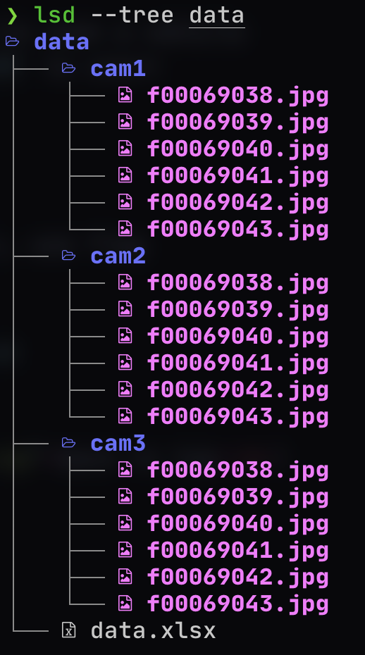

<div id="top"></div>

# CARLA-VPR-DATA-COLLECTOR: Image data collection for Visual Place Recognition 
By [Sudharsan Ananth](https://sudharsan-007.github.io), [Aabid](https://www.linkedin.com/in/)

New York University

<!-- TABLE OF CONTENTS -->
<details>
  <summary>Table of Contents</summary>
  <ol>
    <li>
      <a href="#about-the-project">About This Project</a>
      <ul>
        <li><a href="#implementation">Implementation</a></li>
      </ul>
    </li>
    <li>
      <a href="#getting-started">Getting Started</a>
      <ul>
        <li><a href="#dependencies">Dependencies</a></li>
        <li><a href="#installation">Installation</a></li>
      </ul>
    </li>
    <li><a href="#methodology">Methodology</a></li>
    <li><a href="#experiment">Experiment</a></li>
    <li><a href="#results">Results</a></li>
    <li><a href="#license">License</a></li>
    <li><a href="#acknowledgments">Acknowledgments</a></li>
  </ol>
</details>


<!-- ABOUT THE PROJECT -->
## About The Project


Visual Place Recognition exploded in popularity over the recent years. Visual Place Recognition (VPR) is often characterized as being able to recognize the same place despite significant changes in appearance and viewpoint. VPR is a key component of Spatial Artificial Intelligence, enabling robotic platforms and intelligent augmentation platforms such as augmented reality devices to perceive and understand the physical world. Visual place recognition is a challenging problem due to the vast range of ways in which the appearance of real-world places can vary.

Though the research has gained popularity in the previous years, the lack of dynamic data over multiple seasons of the same place and/or route for the purpose of VPR has made it significantly challenging to train and evaluate models for Long-term Visual Place Recognition. Even though oxford robocar provides this data, it contains only front view monocular vison, and depth camera. Other dataset over the seasons are either stationary or does not over dynamic weather or seasons. 

This repo contains the code to generate such dynamic, multi seasonsonal data specicially for the purpose for Visual Place Recognition wither Autonomously or by manually driving the car. This code can Navigate all the default maps of carla simulator and collect multiple sensor data for training or evaluation of VPR models. The data is sequential hence this is suitable for semi-supervised, self-supervised, unsupervised models as well. 

The objective of this project:
* **Ability to collect VPR data (camera, IMU, GPS, semantic segmentation images) unmonitored in a remote server autonomously**
* Develop large scale data collection pipeline for Visual Place Recognition
* Visualize the data during the data collection process
* Have manual control and autonmous modes implemented
* Multi camera support 
* Dynamic weather and seasonal changes simulation
* Simple keyboard interface

This Project showed interesting results and we hope would help community better develop VPR models. 

Use the `README.md` to get started.

<p align="right">(<a href="#top">back to top</a>)</p>


### Implementation

This project is built with the below given major frameworks and libraries. The code is primarily based on python. Some plugins (OpenCV and Matplotlib) are added for data visualization.

This section should list any major frameworks/libraries used to bootstrap your project. Leave any add-ons/plugins for the acknowledgements section. Here are a few examples.

* [Python](https://www.python.org/)
* [PyTorch & Torchvision](https://pytorch.org/)
* [Pandas](https://pandas.pydata.org)
* [NumPy](https://numpy.org)
* [OpenCV](https://docs.opencv.org/4.x/d6/d00/tutorial_py_root.html)
* [Matplotlib](https://matplotlib.org/)

<p align="right">(<a href="#top">back to top</a>)</p>

<!-- GETTING STARTED -->

## Getting Started

Sample data is available at [here]()

### Dependencies

This project uses python. Hence python version 3.7.xx or higher should be installed. We recommend installing with Anaconda and adding it to the path of Windows. Git is also recommended to easily download files from GitHub. Alternatively you can also download the folder from GitHub directly. The links for both are given below
* [Python](https://www.python.org/)
* [Git](https://git-scm.com/)

### Installation

_How to reproduce the result and or clone the repository_

1. Clone the repo
   ```sh
   git clone https://github.com/sudharsan-007/Carla-vpr-data-collector.git
   ```
2. Change Directory into the folder
   ```
   cd Carla-vpr-data-collector
   ```
3. Create conda environment 
   ```
   conda create -n carla-vpr-dc
   ```
4. Download and Install Carla Simulator
5. Install Carla Dependencies(change the version to your version of Carla Simulator)
    ```
    pip3 install carla==0.9.4
    ```
6. Install requirements
   ```
   pip3 install requirements.txt
   ```
7. Run main script `main.py` to spwan a vehicle and start driving it. Press `R` to start collecting data.
   ```
   python3 main.py
   ```


<p align="right">(<a href="#top">back to top</a>)</p>

## Data Structure




<p align="right">(<a href="#top">back to top</a>)</p>


<!-- ROADMAP -->
## Experiment

Tests were conducted to verify the data collection using this method is as close to real world as possible. Various networks were trained and tested to verify that real world results match generated data. 

<p align="right">(<a href="#top">back to top</a>)</p>

## Results

Data collected using this repo has been tested in popular visual place recognition algorithms. 


| Model              | Day/Night | Weather   | No of params | recall rate (%) | triplet loss |
|------              | --------  | -------   | ----------   | --------        | --------     |
| ResNet18 + NetVLAD | Day       | Clear-noon | 4.2M        | 69.02%          | 0.000342 |
| ResNet18 + NetVLAD | Night     | Clear      | 4.2M          | 47.43%          | 0.000474 |
| ResNet18 + NetVLAD | Day       | Rain-sunset | 4.2M         | 65.39%          | 0.000377 |
| ResNet50 + NetVLAD | Day       | Rain-sunset | 18.65M       | 72.92%          | 0.00028 |


<!-- LICENSE -->
## License

Distributed under the MIT License. See `LICENSE.txt` for more information.

<p align="right">(<a href="#top">back to top</a>)</p>


<!-- CONTACT -->
## Contact

[Sudharsan Ananth]([sudharsan.ananth@gmail.com](https://sudharsanananth.wixsite.com/sudharsan)) - sudharsan.ananth@gmail.com


Project Link: [https://github.com/sudharsan-007/Carla-vpr-data-collector.git](https://github.com/sudharsan-007/Carla-vpr-data-collector.git)

<p align="right">(<a href="#top">back to top</a>)</p>


<!-- ACKNOWLEDGMENTS -->
## Acknowledgments

Thanks to AI4CE Lab for fueling this research. We are grateful to Prof. Chen Feng for this excellent support and feedbacks through out this project. Also to Chao Chen for mentoring me through out this project. 


<p align="right">(<a href="#top">back to top</a>)</p>

